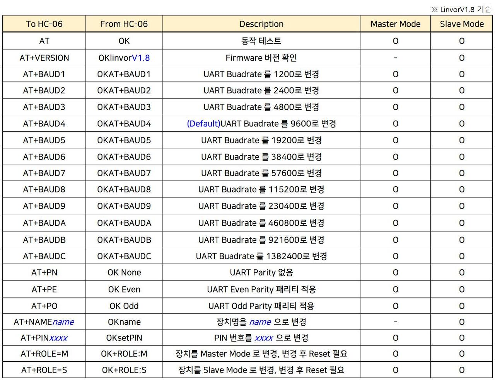

# HM-10 Bluetooth module

## 사양
	- 작동 전압 : 5V
	- 블루투스 버젼 : 4.0
	- default name : HMSoft
	- default baud rate(Serial Connection) : 9600

## 필요 하드웨어
	- HM-10
	- Arduino UNO
	- UNO cable
	- F-M cable(4ea)

## 연결
	- TXD, RXD를 UNO보드의 Dgital중 원하는 핀으로 연결하여 사용합니다.(본문에서는 D6, D7 사용)

|HM-10|Arduino UNO|
|--|--|
|GND|GND|
|VCC|5V|
|TXD|D6(변경 가능)|
|RXD|D7(변경 가능)|

## 라이브러리
	- SoftwareSerial

## AT Command
	- AT 명령어를 사용하여 블루투스 상태 확인이 가능하다.
	- 시리얼 모니터로 AT 커맨드를 전송하여 사용 가능하다.(사용 시 전송옵션을 변경해서 사용요망)

## example_code.cpp 참고